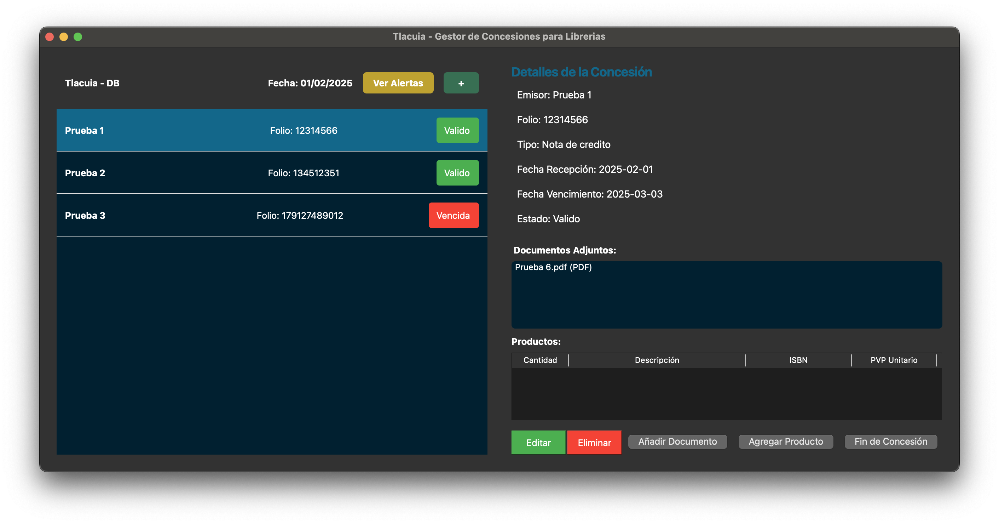
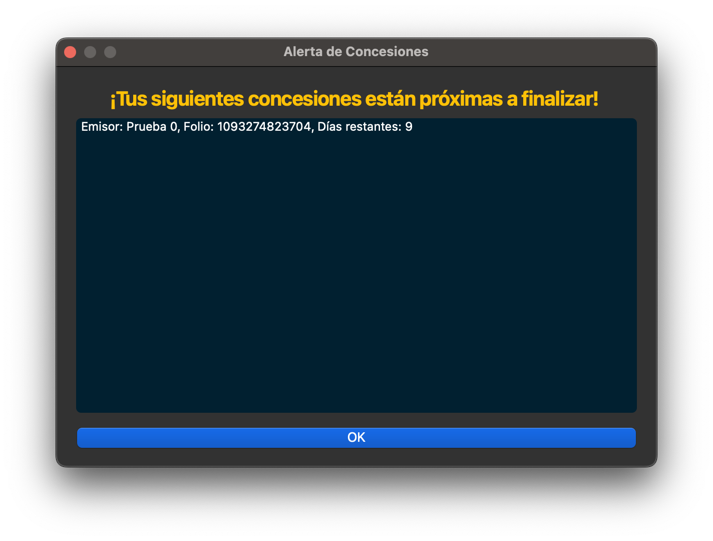
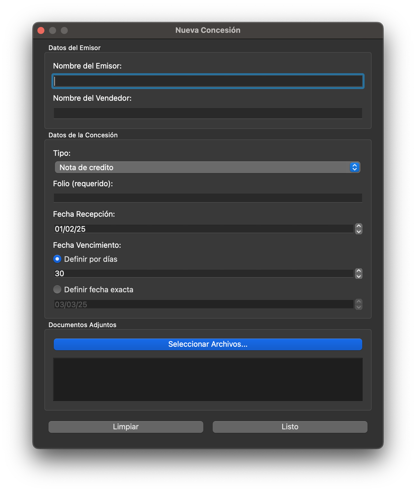
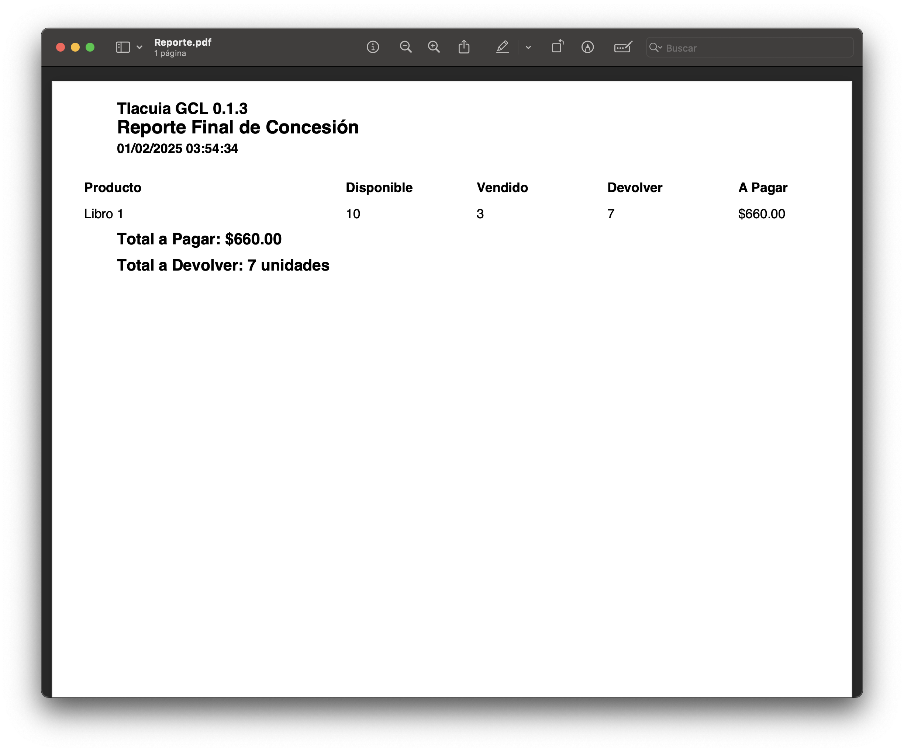

# Tlacuia Gestor de Concesiones para Librerias

Tlacuia GCL, del nahuatl *tomar prestado*, es un pequeña aplicacion de escritorio desarrollada en Python con PyQt5 y SQLite para poder facilitar la gestion de concesiones en librerias de tamaño mediano y pequeño al centralizarlo en este. Uno de los principales objetivos de Tlacuia es ayudar a los libreros con alertas de vencimiento de sus concesiones.

## Apoya mi trabajo

Soy un estudiante en Mexico que tambien trabaja y hace esto durante su tiempo libre, asi que si te gusto este proyecto y tienes la oportunidad de apoyarme, puedes invitarme un cafe!!!

## Screenshots

### Pantalla principal

*Interfaz principal del GCL*

### Dialogo de Alerta

*Dialogo de alerta por proximo vencimiento de una concesion*

### Añadir una nueva concesion

*Formato para crear una nueva concesion*

### Reporte generado

*Ejemplo de reporte de corte generado tras finalizar una concesion*

## Caracteristicas principales

- **Gestion de Conseciones**

    - Crear, editar y eliminar concesiones en una base de datos
    - Registrar informacion detallada de las concesiones
    - Visualizacion grafica de las concesiones proximas a vencer

- **Gestion de productos**

    - Permite agregar los productos asociados a la concesion
    -  Reporte de corte al finalizar la concesion

- **Centralizacion de documentos**

    - Permite agregar y almacenar en la base de datos de Tlacuia los documentos relacionados a la concesion

## Dependencias

- **Python 3.10**
- **PyQt5**
- **SQLite**
- **Reportlab**

## Licencia

Este proyecto esta bajo licencia MIT.

## Agradecimientos

Gracias José por soportarme hablar cosas tecnicas de mis proyectos que no tienen mucho caso, te quiero mucho.

Hecho con brillitos homosexuales por un gei con sueño, para mi libreria LGBTTTIQ+ mas querida, Somos Voces en Ciudad de Mexico. 🏳️‍🌈
